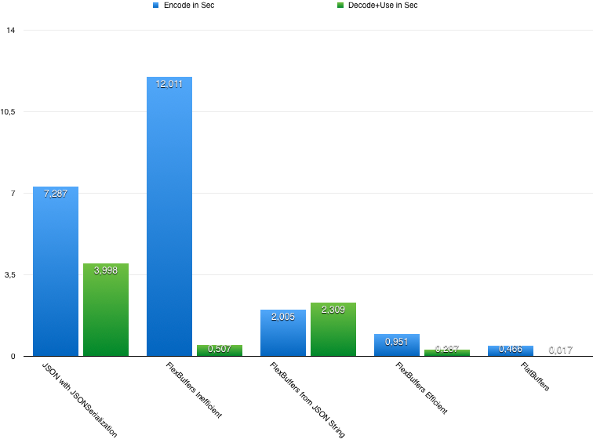

# FlexBuffersSwift
[](https://github.com/Carthage/Carthage)

Swift implementation of FlexBuffers - a sub project of Googles FlatBuffers project [https://google.github.io/flatbuffers/].
FlexBuffers is a self suficient binary data representation which can encode numbers, strings, maps and vectors.

# Usage
```swift
// {vec:[-100,"Fred",4.0], bar:[1,2,3], bar3:[1,2,3], foo:100, mymap:{foo:"Fred"}}
let flx = FlexBuffer()
try!flx.addMap {
    try!flx.addVector(key: "vec") {
        flx.add(value: -100)
        flx.add(value: "Fred")
        flx.add(value:4.0)
    }
    try!flx.add(key: "bar", value: [1, 2, 3])
    try!flx.addVector(key: "bar3") {
        flx.add(value:1)
        flx.add(value:2)
        flx.add(value:3)
    }
    try!flx.add(key: "foo", value: 100)
    try!flx.addMap(key: "mymap") {
        flx.add(key: "foo", value: "Fred")
    }
}
let data = flx.finish()

let map = try!FlexBuffer.decode(data: data)!.asMap!
print(map.debugDescription)
```

There is also an API for convinient encoding, which is however inefficient
```swift
let data = try!FlexBuffer.encodeInefficientButConvenient([
    "age" : 35,
    "flags" : [true, false, true, true],
    "weight" : 72.5,
    "address" : [
        "city" : "Bla",
        "zip" : "12345",
        "countryCode" : "XX"
    ]
])
```

FlexBuffersSwift also incorporates it's own efficient JSON parser which is used to transform JSON to FlexBuffer binary.

```
let data = try!FlexBuffer.dataFrom(jsonData:"{name:\"Maxim\", birthday:{\"year\": 1981, month: 6, day: 12}}".data(using: .utf8)!)
```

The binary can than be read with no parsing costs in a strong typed way:

```
let accessor = FlexBuffer.decode(data:data)
let name = accessor?["name"]?.asString
let day = accessor?["birthday"]?["day"]?.asInt
```

# Performance
The strength of FlexBuffers is that it supports random data access without need of upfront parsing or any kind of data interpretation.
But even when all data has to be accessed it runs about 15 times more performant than JSON.
Please have a look at `FlexBuffersPerformanceTest` target.

Results on MBP Retina 2015
2,8 GHz Intel Core i7
16 GB 1600 MHz DDR3

```
Efficient FlexBuffers encoding (x100000):
676 bytes in 0.951330006122589 106.324 MB
-
Inefficient FlexBuffers encoding (x100000):
938 bytes in 12.0113599896431 297.566 MB
-
JSON encoding (x100000):
657 bytes in 7.28703099489212 443.969 MB
-
FlatBuffers encoding (x100000):
352 bytes in 0.466732025146484 84.4922 MB
-
FlatBuffers encoding without data duplication (x100000):
304 bytes in 0.602275967597961 75.4727 MB
-
FlexBuffers encoding from JSON string (x100000):
704 bytes in 2.00572603940964 156.914 MB
-------------
Decoding (x100000) result of efficient FlexBuffers encoding:
864436166550000 in 0.287814974784851 0.00390625 MB
-
Decoding (x100000) result of efficient FlexBuffers encoding and using access chaining:
864436166550000 in 0.507194995880127 0.0078125 MB
-
Decoding (x100000) result of inefficient FlexBuffers encoding:
864436166550000 in 0.293328046798706 0.00390625 MB
-
Decoding (x100000) JSON:
864436166550000 in 3.99850696325302 169.41 MB
-
Decoding (x100000) FlatBuffers:
864436166550000 in 0.0176529884338379 0.00390625 MB
-
Decoding FlexBuffers created from JSON string (x100000):
864436166550000 in 0.301981985569 0.0078125 MB
-
Decoding JSON by encoding it to FlexBuffers and than using it (x100000):
864436166550000 in 2.30986094474792 201.031 MB
-
Decoding unsorted JSON by encoding it to FlexBuffers and than using it (x100000):
864436166550000 in 2.36321097612381 203.129 MB
-
```


